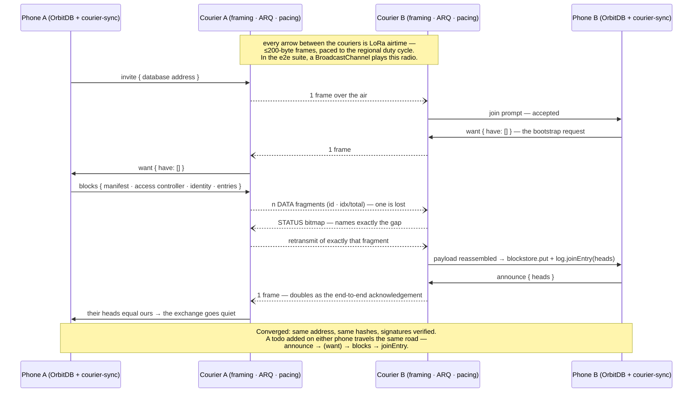

# Funkpost

[](https://meshtastic.org)

*Post über Funk* — a byte courier for local-first applications over LoRa mesh
radios; works with Meshtastic® devices. A courier carries what it is handed,
and this one is handed two very different things: handshakes and databases.
One radio, two planes — they share the courier and nothing else, so the
difference gets a table, not a footnote:

| | **signalling plane** | **data plane** |
|---|---|---|
| what crosses the mesh | the WebRTC handshake: offer and answer, as small signed payloads | the database itself: OrbitDB entries, as signed blocks |
| WebRTC | yes — and the connection afterwards still needs an IP path (same Wi-Fi, or both online) | none — no offer, no answer, no IP path anywhere |
| built? | designed, **not built** | **built and tested** (plan steps S1–S4) |
| design thread | [libp2p-webrtc-qr#161](https://github.com/NiKrause/libp2p-webrtc-qr/issues/161) | [issue #1](https://github.com/NiKrause/funkpost/issues/1) |
| the sentence to remember | *LoRa carries the handshake, not the connection.* | *The mesh carries the data when there is no connection to carry.* |

The announcement page for both, written for humans:
[lora.le-space.de](https://lora.le-space.de/).

**Try it now:** the demo — a todo list crossing a LoRa mesh — runs at
**[nikrause.github.io/funkpost](https://nikrause.github.io/funkpost/)**. Open
it twice with `?mesh=bc` and two browser tabs play the two phones; with a
Meshtastic node over Web Bluetooth, *Connect node* makes it real. Every push
to main redeploys it.

## The data plane — built

Two peers whose *only* link is the mesh cannot have a WebRTC channel — but
they can have a replicated OrbitDB database: entry by entry over the radio,
big things via [Storacha](https://github.com/NiKrause/orbitdb-storacha-bridge)
once one side finds the internet again. Design, arithmetic and the S1–S5
build plan live in
[issue #1](https://github.com/NiKrause/funkpost/issues/1)
(the plan itself:
[the build-plan comment](https://github.com/NiKrause/funkpost/issues/1#issuecomment-5532165277);
the per-jurisdiction airtime law:
[the duty-cycle comment](https://github.com/NiKrause/funkpost/issues/1#issuecomment-5531989292)).

The transport-neutral half — `courier-sync`, the diff/bundle/apply protocol —
deliberately does **not** live here: it is MIT, designed against an abstract
courier in
[orbitdb-storacha-bridge#50](https://github.com/NiKrause/orbitdb-storacha-bridge/issues/50),
and this repository binds it to the radio. The licence section below says why
that direction is the only one that works.

### One bootstrap, end to end

No WebRTC anywhere in this picture — that is the point of the plane:



### The example: mesh-todo

[`examples/mesh-todo`](examples/mesh-todo) runs that sequence live and is the
bench instrument in one: a todo list on OrbitDB, replicating over the courier,
with a sync pane that prices every protocol message in packets and airtime —
the hardware gates are read off exactly that pane. It is deployed at
**[nikrause.github.io/funkpost](https://nikrause.github.io/funkpost/)**; for
local development:

```sh
npm run dev -w @le-space/mesh-todo-example
```

Open it twice with `?mesh=bc` and the two tabs play the two phones over a
BroadcastChannel fake mesh (`&loss=0.15` makes the radio lossy). Without the
parameter, *Connect node* opens the Web Bluetooth chooser for a real
Meshtastic node — Chrome/Edge, user gesture required, and on a phone the page
must be served over HTTPS (during development: `adb reverse tcp:5199 tcp:5199`
makes the dev server a secure `localhost` on the phone). Write access in the
demo list is open on purpose: the mesh channel's PSK is the demo's trust
boundary, and per-identity ACLs are a design conversation in issue #1.

### Tests, and the gate that remains

```sh
npm test
```

runs the unit and integration suites, including the composed proof
([`test/full-stack.test.js`](test/full-stack.test.js)): two OrbitDB peers
converge through courier-sync → ARQ → pacing → a mesh that drops frames, while
both libp2p nodes hold **zero connections**. The e2e suite
([`examples/mesh-todo/e2e`](examples/mesh-todo/e2e)) then runs the whole
hand-test script in CI — clean mesh, a mesh that eats a fifth of all frames,
the empty-room regression, and a wiped peer re-bootstrapping its history.

Only physics is missing, and physics is plan step S5:

```sh
NODE_A=<ip> NODE_B=<ip> npm run bench:goodput
```

drives the real courier between two TCP-reachable nodes and prints the gate
numbers — single-entry latency (target: seconds to low tens) and the
ten-entry bootstrap, where **over ~10 minutes on a quiet channel, live sync
loses to the pointer-CID mode** (issue #1's phase-2 gate).

## The signalling plane — designed, not built

The plane this repository was originally named for — it began life as
`libp2p-webrtc-qr-meshtastic`, before the data plane existed and the courier
turned out to be the constant worth naming. WebRTC's offer and answer travel
as small signed payloads between two Meshtastic nodes, so the
[libp2p-webrtc-qr](https://github.com/NiKrause/libp2p-webrtc-qr) handshake
needs no camera, no messenger and no speaker — and works through walls and
across floors, to a counter with nobody standing at it. The full design —
topologies, the unattended endpoint, the guest-node turnstile, the security
analysis — lives in
[libp2p-webrtc-qr#161](https://github.com/NiKrause/libp2p-webrtc-qr/issues/161).

What it will **not** do, said louder than anything else because this plane
invites the misreading: **LoRa carries the handshake, not the connection.**
WebRTC still needs an IP path between the peers — the same Wi-Fi, or both
online with NAT traversal working. Two peers linked only by mesh verify each
other's signatures perfectly and never connect. That case is exactly what the
data plane above exists for.

Three questions gate the build, answerable on hardware, two of them able to
end the idea (from #161):

1. **How long does one handshake take over a single hop?** Compact offer plus
   answer, LongFast, quiet channel. The estimate is 15–45 s; minutes would
   kill the in-the-room case and leave only long range.
2. **Does `watchAdvertisements()` work without a Chrome flag?** Decides
   whether a waiting phone listens for a free BLE slot or falls back to
   jittered polling.
3. **Does a node refuse a second BLE client, or evict the first?** The
   failure mode decides how a shared guest node behaves when somebody taps at
   the wrong moment.

It asks for the compact (v3) payload explicitly — ~284 bytes is two LoRa
packets where a full SDP is five or six — and when it is built, it rides the
byte courier below: its offer and answer are just another payload.

## Shared underneath: the byte courier

One transport, two planes. Everything here is radio-free and fully tested:

- [`lib/framing.js`](lib/framing.js) — fragments sized to a mesh packet
  (`id · idx/total`), plus a STATUS frame carrying the receiver's bitmap
- [`lib/meshtastic-courier.js`](lib/meshtastic-courier.js) — selective-ACK ARQ
  over any link: retransmits exactly the missing fragments, bounded rounds;
  `send()` resolves on transmission by default (a broadcast into an empty
  room must not hang) and on acknowledgement with `awaitDelivery: true`
- [`lib/pacing.js`](lib/pacing.js) — airtime estimates per modem preset and a
  token bucket that paces transmissions to the regional duty cycle, so the
  firmware never has to refuse and ARQ never mistakes legal throttling for loss
- [`lib/regions.js`](lib/regions.js) — jurisdictions as data: one row per
  firmware region with its airtime budget and legal framework; a node with
  region `UNSET` is refused, not transmitted through
- [`lib/links/meshtastic-device-link.js`](lib/links/meshtastic-device-link.js) —
  the thin binding to a real node: `@meshtastic/core` over the private
  application port, plus region and airtime-utilisation watchers
- [`lib/links/memory-mesh.js`](lib/links/memory-mesh.js) — the radio's test
  double: MTU-enforcing, lossy, duplicating, jittering

## The topology (both planes)

```
phone ↔ BLE ↔ its own node ↔ LoRa ↔ peer node ↔ BLE ↔ phone / tablet
```

A browser reaches a Meshtastic node over Web Bluetooth
([`@meshtastic/transport-web-bluetooth`](https://meshtastic.org/docs/development/js/),
the only transport that fits a phone). One BLE client per node is a firmware
rule, so each side brings its own. Chrome/Edge on Android and desktop; no iOS,
no Firefox; the page must be foreground with the screen on.

## Why this is a separate repository

**Licence, not taste.** [`@meshtastic/core`](https://www.npmjs.com/package/@meshtastic/core)
and `@meshtastic/transport-web-bluetooth` are **GPL-3.0-only**.
`@le-space/libp2p-webrtc-qr` is **Apache-2.0 OR MIT**, and a permissive library
that pulled GPL-3.0 into its consumers' builds would be misrepresenting its own
licence — the optional-peer-dependency pattern it uses for `ggwave` works
because ggwave is MIT.

So this repository is **GPL-3.0**, and it depends on the permissive packages
rather than the other way round. Permissive flows into copyleft; the reverse is
what fails. The split is recorded from the other side as roadmap items 18–19
in [the main repository's ROADMAP](https://github.com/NiKrause/libp2p-webrtc-qr/blob/main/ROADMAP.md).

One consequence stated in advance, because it is a one-way door: anything that
turns out to belong in a permissive package — the carrier-neutral framing, the
sync seam — has to be written **there** and used from here. Designing it here
and wanting it back later does not work. That is why `courier-sync` lives in
orbitdb-storacha-bridge and this repository only implements its courier
contract.

## Trademarks

Meshtastic® is a registered trademark of Meshtastic LLC. Meshtastic software
components are released under various licenses, see GitHub for details. No
warranty is provided - use at your own risk.

LoRa® is a trademark of Semtech Corporation.

This project is not affiliated with or endorsed by Meshtastic LLC or Semtech;
it *works with* Meshtastic devices and is named to say so. The M-PWRD badge
above is the logo Meshtastic's [trademark policy](https://meshtastic.org/docs/legal/trademark/)
provides for projects using the technology, no grant required; the asset is the
official one from [meshtastic/design](https://github.com/meshtastic/design/tree/master/Meshtastic%20Powered%20Logo).
Commercial use of the Meshtastic firmware and marks carries their own terms in
addition to the GPLv3.

## Licence

GPL-3.0-only. See [LICENSE](LICENSE).
