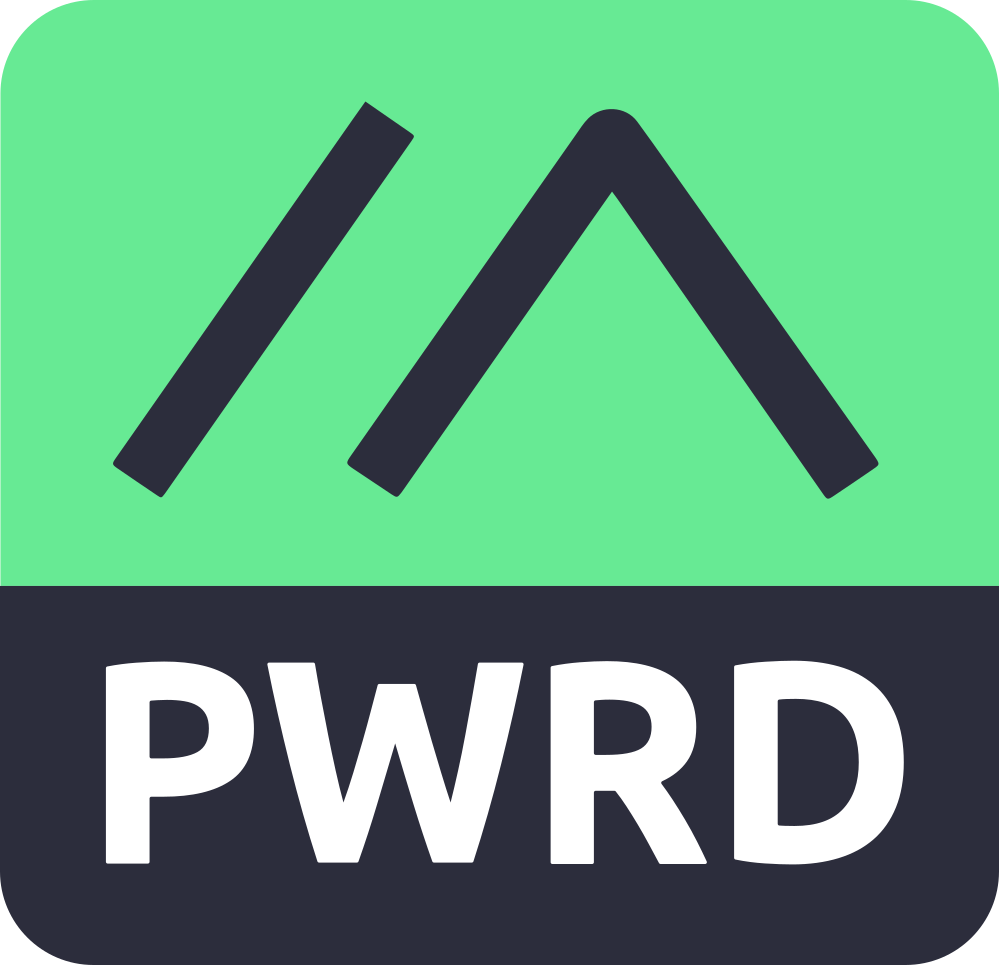

# Funkpost

[](https://meshtastic.org)

*Post über Funk* — a byte courier for local-first applications over LoRa mesh
radios; works with Meshtastic® devices. A courier carries what it is handed,
and this one is handed two very different things: handshakes and databases.
One radio, two planes — they share the courier and nothing else, so the
difference gets a table, not a footnote:

| | **signalling plane** | **data plane** |
|---|---|---|
| what crosses the mesh | the WebRTC handshake: offer and answer, as small signed payloads | the database itself: OrbitDB entries, as signed blocks |
| WebRTC | yes — and the connection afterwards still needs an IP path (same Wi-Fi, or both online) | none — no offer, no answer, no IP path anywhere |
| built? | designed, **not built** | **built and tested** (plan steps S1–S4) |
| design thread | [libp2p-webrtc-qr#161](https://github.com/NiKrause/libp2p-webrtc-qr/issues/161) | [issue #1](https://github.com/NiKrause/funkpost/issues/1) |
| the sentence to remember | *LoRa carries the handshake, not the connection.* | *The mesh carries the data when there is no connection to carry.* |

The announcement page for both, written for humans:
[lora.le-space.de](https://lora.le-space.de/).

> ### ⚠ Experimental — not for production use
>
> This is a research project. It is **not audited**, and its purpose is to
> evaluate what a LoRa mesh can carry and how two devices reconcile data over
> it — throughput, airtime, convergence. Nothing more.
>
> **Authorisation has not been designed.** That is not an oversight to be found
> later; it is a gap that is known, measured, and stated here:
>
> - In `mesh-todo` the database is opened with `write: ["*"]`. **Anyone who
>   hears an invite may write to the list.**
> - In `mesh-appointments` a booking request carries no signature. A neighbour
>   with no key, no capability and no invitation can inject them — measured on
>   the demo's own default shop: **516 of 516 slots taken, all three weeks
>   gone, and the real customer's booking superseded**, because a forged
>   request may claim any timestamp it likes.
>
> The only boundary today is the **channel key**: whoever can decrypt the
> channel can write. On a public Meshtastic channel that is no boundary at all.
> A private channel is the difference between a demo and a toy, and it is still
> not authorisation.
>
> The examples are **demonstrators**, meant to be read and measured — not
> deployed, and not pointed at anybody's real calendar.

**Try it now.** Both demos are live, one per data plane, and every push to main
redeploys both:

Both live at **[nikrause.github.io/funkpost](https://nikrause.github.io/funkpost/)**,
which is a menu:

| | | |
|---|---|---|
| **[…/mesh-todo/](https://nikrause.github.io/funkpost/mesh-todo/)** | `mesh-todo` | a todo list over LoRa — the **OrbitDB** plane |
| **[…/termine/](https://nikrause.github.io/funkpost/termine/)** | `mesh-appointments` | a hairdresser's appointment book — the **Yjs** plane |

Open either twice with `?mesh=bc` and two browser tabs play the two devices
(the booking demo wants `&role=salon` in one and `&role=customer` in the
other); with a Meshtastic node over Web Bluetooth, *Connect node* makes it
real.

The `/termine/` path is a **one-way door** — every `.ics` the booking demo has
ever produced carries a change link pointing at it.

## Status

**4 September 2026 — the first over-the-air replication.** A todo list
replicated end to end over a **real LoRa mesh** between two independent
Meshtastic nodes, with **no IP path**: `db.put` on one side, a delta over the
paced ARQ courier, the LoRa hop, `joinEntry` on the other, both lists
converged. Two desktop browsers, each driving its own node over Web Bluetooth.

Since then a **second data plane** landed on the same courier — a Yjs provider
whose updates are tens of bytes rather than kilobytes — demonstrated by an
appointment book for a local business. The courier needed no changes for it,
which was the claim worth testing.

What is *not* settled, and what each bench session cost, is kept honestly in
**[field notes](docs/field-notes.md)**. Sequencing and gates are in
**[ROADMAP.md](ROADMAP.md)**.

## Where things are written down

The front page is deliberately short. One page per layer, each opening with
what is built and what is not:

| | |
|---|---|
| **[The byte courier](docs/courier.md)** | framing, selective-ACK ARQ, duty-cycle pacing — carries both planes, knows about neither |
| **[Links to a node](docs/links.md)** | Web Bluetooth reality, the reconnect policy, reading what the radio says |
| **[The OrbitDB plane](docs/data-plane-orbitdb.md)** | signed entries and an access controller; the bootstrap, end to end |
| **[The Yjs plane](docs/yjs-provider.md)** | tiny, loss-tolerant updates — and reusable outside this project |
| **[The appointment book](docs/appointments.md)** | the Yjs plane's demo: rules not lists, and who got the slot |
| **[The signalling plane](docs/signalling.md)** | designed, not built — LoRa carries the handshake, not the connection |
| **[Field notes](docs/field-notes.md)** | what broke on real hardware, and why |
| **[Why a separate repository](docs/why-separate-repository.md)** | a licence decision, and a one-way door |

## Two data planes, one courier

The courier moves opaque bytes, so what sits on top is a choice — and both
choices ship:

| | **[OrbitDB plane](docs/data-plane-orbitdb.md)** | **[Yjs plane](docs/yjs-provider.md)** |
|---|---|---|
| gives you | signed entries, an access controller, verifiable history | tiny, loss-tolerant, order-independent updates |
| first contact | ~2 KB for a two-item list | tens of bytes |
| pick it when | who wrote what must be provable | the channel key is trust enough |

**The Yjs provider is reusable outside this project.** It needs only a courier
— any object with `send(bytes)` and `onPayload(cb)` — so a WebSocket, a
`BroadcastChannel` or your own transport works as well as a LoRa mesh:

```js
import { createYjsProvider } from "@le-space/funkpost/yjs";
const provider = createYjsProvider({ doc, courier });
```

`yjs` is an optional peer dependency behind its own subpath, so the byte
courier stays dependency-light for everyone else.

## The topology

```
   Phone A ──BLE── Node A ))))  LoRa  (((( Node B ──BLE── Phone B
      │                                                      │
      └── funkpost courier: framing · ARQ · duty-cycle pacing ┘
                    │                        │
        OrbitDB plane                  Yjs plane
```

No IP path anywhere in that picture. That is the whole point, and everything
else is detail — which now lives on its own page.

## Trademarks

Meshtastic® is a registered trademark of Meshtastic LLC. Meshtastic software
components are released under various licenses, see GitHub for details. No
warranty is provided - use at your own risk.

LoRa® is a trademark of Semtech Corporation.

This project is not affiliated with or endorsed by Meshtastic LLC or Semtech;
it *works with* Meshtastic devices and is named to say so. The M-PWRD badge
above is the logo Meshtastic's [trademark policy](https://meshtastic.org/docs/legal/trademark/)
provides for projects using the technology, no grant required; the asset is the
official one from [meshtastic/design](https://github.com/meshtastic/design/tree/master/Meshtastic%20Powered%20Logo).
Commercial use of the Meshtastic firmware and marks carries their own terms in
addition to the GPLv3.

## Licence

GPL-3.0-only. See [LICENSE](LICENSE).
