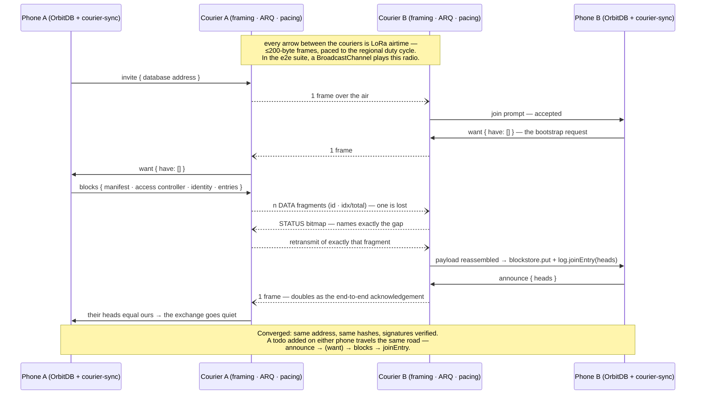
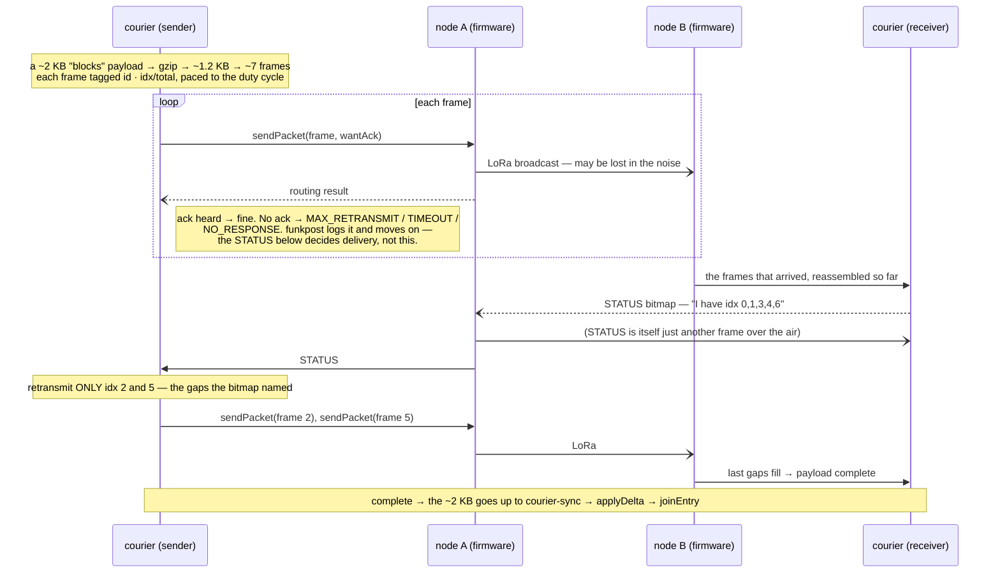

# Funkpost

[](https://meshtastic.org)

*Post über Funk* — a byte courier for local-first applications over LoRa mesh
radios; works with Meshtastic® devices. A courier carries what it is handed,
and this one is handed two very different things: handshakes and databases.
One radio, two planes — they share the courier and nothing else, so the
difference gets a table, not a footnote:

| | **signalling plane** | **data plane** |
|---|---|---|
| what crosses the mesh | the WebRTC handshake: offer and answer, as small signed payloads | the database itself: OrbitDB entries, as signed blocks |
| WebRTC | yes — and the connection afterwards still needs an IP path (same Wi-Fi, or both online) | none — no offer, no answer, no IP path anywhere |
| built? | designed, **not built** | **built and tested** (plan steps S1–S4) |
| design thread | [libp2p-webrtc-qr#161](https://github.com/NiKrause/libp2p-webrtc-qr/issues/161) | [issue #1](https://github.com/NiKrause/funkpost/issues/1) |
| the sentence to remember | *LoRa carries the handshake, not the connection.* | *The mesh carries the data when there is no connection to carry.* |

The announcement page for both, written for humans:
[lora.le-space.de](https://lora.le-space.de/).

**Try it now:** the demo — a todo list crossing a LoRa mesh — runs at
**[nikrause.github.io/funkpost](https://nikrause.github.io/funkpost/)**. Open
it twice with `?mesh=bc` and two browser tabs play the two phones; with a
Meshtastic node over Web Bluetooth, *Connect node* makes it real. Every push
to main redeploys it.

## Status — first over-the-air replication, 2026-09-04

On **4 September 2026** a todo list replicated end to end over a **real LoRa
mesh** between two independent Meshtastic nodes, with **no IP path** — the whole
stack running as designed: `db.put` on one side, courier-sync's delta over the
paced ARQ courier, the LoRa hop, `joinEntry` on the other, both lists
converged. Confirmed on **two desktop browsers** (Chrome and Opera, each
driving its own node over Web Bluetooth). The data plane works on hardware.

Honest about what is not settled yet:

- **Phones vary by Bluetooth stack.** A **Samsung Fold 5** (One UI, Chrome)
  drops the BLE link repeatedly — an OS Bluetooth-stack instability that hits
  the official Meshtastic web client too, not funkpost's code (the courier now
  reconnects and resumes, but a stack that keeps failing `gatt.connect` cannot
  be cured from JavaScript). **GrapheneOS with Vanadium** held the link with
  **no disconnects** — a promising sign — though a full end-to-end replication
  there is not yet confirmed, and neither is one from a phone browser generally.
- **First-contact bootstrap reliability.** The initial bundle (manifest,
  access controller, identity and entries — ~2 KB for a two-item list)
  currently can need a retry to cross a busy public channel within the ARQ's
  rounds. Block compression and a more patient ARQ are the planned fix; live
  edits after the bootstrap are small and cross readily.

**Where this is going:** a **second data plane** on the same courier — a Yjs
(CRDT) provider ([#36](https://github.com/NiKrause/funkpost/issues/36)) whose
updates are tens of bytes rather than kilobytes, demonstrated by a
Calendly-shaped appointment book for a local business
([#38](https://github.com/NiKrause/funkpost/issues/38)). Sequencing, phases and
gates are in **[ROADMAP.md](ROADMAP.md)**.

## The data plane — built

Two peers whose *only* link is the mesh cannot have a WebRTC channel — but
they can have a replicated OrbitDB database: entry by entry over the radio,
big things via [Storacha](https://github.com/NiKrause/orbitdb-storacha-bridge)
once one side finds the internet again. Design, arithmetic and the S1–S5
build plan live in
[issue #1](https://github.com/NiKrause/funkpost/issues/1)
(the plan itself:
[the build-plan comment](https://github.com/NiKrause/funkpost/issues/1#issuecomment-5532165277);
the per-jurisdiction airtime law:
[the duty-cycle comment](https://github.com/NiKrause/funkpost/issues/1#issuecomment-5531989292)).

The transport-neutral half — `courier-sync`, the diff/bundle/apply protocol —
deliberately does **not** live here: it is MIT, designed against an abstract
courier in
[orbitdb-storacha-bridge#50](https://github.com/NiKrause/orbitdb-storacha-bridge/issues/50),
and this repository binds it to the radio. The licence section below says why
that direction is the only one that works.

### Two data planes, one courier

The courier moves opaque bytes, so what sits on top is a choice — and both
choices ship:

| | **OrbitDB plane** | **Yjs plane** |
|---|---|---|
| gives you | signed entries, an access controller, verifiable history | tiny, loss-tolerant, order-independent updates |
| first contact | ~2 KB for a two-item list | tens of bytes |
| pick it when | who wrote what must be provable | the channel key is trust enough |
| docs | [issue #1](https://github.com/NiKrause/funkpost/issues/1) | **[docs/yjs-provider.md](docs/yjs-provider.md)** |

**The Yjs provider is reusable outside this project.** It needs only a courier
— any object with `send(bytes)` and `onPayload(cb)` — so a WebSocket, a
`BroadcastChannel` or your own transport works as well as a LoRa mesh:

```js
import { createYjsProvider } from "@le-space/funkpost/yjs";
const provider = createYjsProvider({ doc, courier });
```

`yjs` is an optional peer dependency behind its own subpath, so the byte
courier stays dependency-light for everyone else.

Keeping a node connected through a phone's Bluetooth is its own job, and the
library does it: `connectMeshtasticDevice` holds the reconnect policy every
field session paid for — see **[docs/links.md](docs/links.md)**.

The Yjs plane's demo is an **appointment book for a local business** — its core
is built: availability travels as a rule rather than a list, and two customers
racing for one slot resolve identically on both phones without a single packet
spent deciding. See **[docs/appointments.md](docs/appointments.md)**.

### One bootstrap, end to end

No WebRTC anywhere in this picture — that is the point of the plane:



### Deeper: four layers, and two acknowledgements

The diagram above is the *what*. Underneath it are four layers, each with one
job — and the confusing part (why `MAX_RETRANSMIT` is not a failure) lives at
the boundary between the bottom two.

| layer | job | vocabulary |
|---|---|---|
| **OrbitDB** | hold the data as a signed, content-addressed log | `db.put`, oplog entry, heads, `joinEntry` |
| **courier-sync** | decide *what* to send | `announce` / `want` / `blocks`, `createDelta` / `applyDelta` |
| **courier** | get a payload across a tiny-MTU, lossy carrier | fragments, **STATUS** bitmap, selective-ACK ARQ, pacing |
| **Meshtastic / LoRa** | move one packet over the air | `sendPacket`, `wantAck`, routing result |

**Creating a list** is just `db.put` at the top layer: it writes a signed entry
to the local oplog and updates the *heads* (the newest entries). The database
**address** is the hash of its manifest — the same name, type and access
controller produce the **same address on every device**, which is why an invite
is only that address: whoever opens it lands on the identical database.

**Receiving** never touches `db.put`. courier-sync puts the raw signed blocks
into the blockstore and calls `joinEntry(head)`, which walks the parents *from
local storage*, re-verifies every signature and the access controller, and
splices them in. Authoring uses `put`; replicating uses `blockstore + joinEntry`
— the same split OrbitDB's own pubsub sync uses, and the same the
[Storacha bridge](https://github.com/NiKrause/orbitdb-storacha-bridge) uses to
restore.

Now the crux. **There are two separate acknowledgements, and only one of them
is the truth:**

- **The radio's per-packet ack** (Meshtastic, `wantAck`). When the courier
  hands a frame to the node, it asks the mesh to confirm that one packet. On a
  busy public channel — 140 neighbours all contending — that confirmation
  often never comes back, and the firmware reports **`MAX_RETRANSMIT`** (it
  retried and gave up), **`TIMEOUT`**, or **`NO_RESPONSE`**. Crucially, on a
  broadcast this means *"no ack was heard"* — **not** *"the packet did not
  arrive."* The packet may well have crossed; nobody sent back a receipt. So
  funkpost treats these three as soft: the frame counts as sent, and the
  courier does **not** abort the payload over them.
- **funkpost's end-to-end STATUS bitmap** (the courier's own ARQ). The
  *receiver* answers with a bitmap of exactly which fragments it holds, and the
  sender retransmits **only the missing ones**. This is the real delivery
  authority — it is end to end, it is exact, and it does not depend on the
  radio's unreliable per-hop ack.

One payload's journey, with both acknowledgements shown:



So on a **quiet or private channel** the radio ack usually comes, sends resolve
fast, and a bootstrap crosses in one or two rounds. On a **busy public channel**
the radio ack keeps failing (`MAX_RETRANSMIT`) and airtime burns on the
firmware's own retries — the sync still completes, driven by the STATUS ARQ,
but slowly and wastefully. **A private channel with just the two nodes is both
the reliable setup and the privacy-correct one**; the public channel is for
first contact and demos.

### The example: mesh-todo

[`examples/mesh-todo`](examples/mesh-todo) runs that sequence live and is the
bench instrument in one: a todo list on OrbitDB, replicating over the courier,
with a sync pane that prices every protocol message in packets and airtime —
the hardware gates are read off exactly that pane. It is deployed at
**[nikrause.github.io/funkpost](https://nikrause.github.io/funkpost/)**; for
local development:

```sh
npm run dev -w @le-space/mesh-todo-example
```

Open it twice with `?mesh=bc` and the two tabs play the two phones over a
BroadcastChannel fake mesh (`&loss=0.15` makes the radio lossy). Without the
parameter, *Connect node* opens the Web Bluetooth chooser for a real
Meshtastic node — Chrome/Edge, user gesture required, and on a phone the page
must be served over HTTPS (during development: `adb reverse tcp:5199 tcp:5199`
makes the dev server a secure `localhost` on the phone). Write access in the
demo list is open on purpose: the mesh channel's PSK is the demo's trust
boundary, and per-identity ACLs are a design conversation in issue #1.

### Tests, and the gate that remains

```sh
npm test
```

runs the unit and integration suites, including the composed proof
([`test/full-stack.test.js`](test/full-stack.test.js)): two OrbitDB peers
converge through courier-sync → ARQ → pacing → a mesh that drops frames, while
both libp2p nodes hold **zero connections**. The e2e suite
([`examples/mesh-todo/e2e`](examples/mesh-todo/e2e)) then runs the whole
hand-test script in CI — clean mesh, a mesh that eats a fifth of all frames,
the empty-room regression, and a wiped peer re-bootstrapping its history.

Only physics is missing, and physics is plan step S5:

```sh
NODE_A=<ip> NODE_B=<ip> npm run bench:goodput
```

drives the real courier between two TCP-reachable nodes and prints the gate
numbers — single-entry latency (target: seconds to low tens) and the
ten-entry bootstrap, where **over ~10 minutes on a quiet channel, live sync
loses to the pointer-CID mode** (issue #1's phase-2 gate).

## The signalling plane — designed, not built

The plane this repository was originally named for — it began life as
`libp2p-webrtc-qr-meshtastic`, before the data plane existed and the courier
turned out to be the constant worth naming. WebRTC's offer and answer travel
as small signed payloads between two Meshtastic nodes, so the
[libp2p-webrtc-qr](https://github.com/NiKrause/libp2p-webrtc-qr) handshake
needs no camera, no messenger and no speaker — and works through walls and
across floors, to a counter with nobody standing at it. The full design —
topologies, the unattended endpoint, the guest-node turnstile, the security
analysis — lives in
[libp2p-webrtc-qr#161](https://github.com/NiKrause/libp2p-webrtc-qr/issues/161).

What it will **not** do, said louder than anything else because this plane
invites the misreading: **LoRa carries the handshake, not the connection.**
WebRTC still needs an IP path between the peers — the same Wi-Fi, or both
online with NAT traversal working. Two peers linked only by mesh verify each
other's signatures perfectly and never connect. That case is exactly what the
data plane above exists for.

Three questions gate the build, answerable on hardware, two of them able to
end the idea (from #161):

1. **How long does one handshake take over a single hop?** Compact offer plus
   answer, LongFast, quiet channel. The estimate is 15–45 s; minutes would
   kill the in-the-room case and leave only long range.
2. **Does `watchAdvertisements()` work without a Chrome flag?** Decides
   whether a waiting phone listens for a free BLE slot or falls back to
   jittered polling.
3. **Does a node refuse a second BLE client, or evict the first?** The
   failure mode decides how a shared guest node behaves when somebody taps at
   the wrong moment.

It asks for the compact (v3) payload explicitly — ~284 bytes is two LoRa
packets where a full SDP is five or six — and when it is built, it rides the
byte courier below: its offer and answer are just another payload.

## Shared underneath: the byte courier

One transport, two planes. Everything here is radio-free and fully tested:

- [`lib/framing.js`](lib/framing.js) — fragments sized to a mesh packet
  (`id · idx/total`), plus a STATUS frame carrying the receiver's bitmap
- [`lib/meshtastic-courier.js`](lib/meshtastic-courier.js) — selective-ACK ARQ
  over any link: retransmits exactly the missing fragments, bounded rounds;
  `send()` resolves on transmission by default (a broadcast into an empty
  room must not hang) and on acknowledgement with `awaitDelivery: true`
- [`lib/pacing.js`](lib/pacing.js) — airtime estimates per modem preset and a
  token bucket that paces transmissions to the regional duty cycle, so the
  firmware never has to refuse and ARQ never mistakes legal throttling for loss
- [`lib/regions.js`](lib/regions.js) — jurisdictions as data: one row per
  firmware region with its airtime budget and legal framework; a node with
  region `UNSET` is refused, not transmitted through
- [`lib/links/meshtastic-device-link.js`](lib/links/meshtastic-device-link.js) —
  the thin binding to a real node: `@meshtastic/core` over the private
  application port, plus region and airtime-utilisation watchers
- [`lib/links/memory-mesh.js`](lib/links/memory-mesh.js) — the radio's test
  double: MTU-enforcing, lossy, duplicating, jittering

## The topology (both planes)

```
phone ↔ BLE ↔ its own node ↔ LoRa ↔ peer node ↔ BLE ↔ phone / tablet
```

A browser reaches a Meshtastic node over Web Bluetooth
([`@meshtastic/transport-web-bluetooth`](https://meshtastic.org/docs/development/js/),
the only transport that fits a phone). One BLE client per node is a firmware
rule, so each side brings its own. Chrome/Edge on Android and desktop; no iOS,
no Firefox; the page must be foreground with the screen on.

## Field notes

Specifics learned building this on real hardware — so the next person doesn't
lose the same afternoon.

**Meshtastic over Web Bluetooth**
- The config stream (region, channels, node info) is sent once on connect and
  never replays — subscribe to every event *before* calling `configure()`, or
  a fast link races past it and shows no channels.
- Read the region *continuously*, not once: a node that just rebooted (e.g.
  after a channel import) reports its region a beat late, and a one-shot read
  freezes on the transient `UNSET`.
- `sendPacket` defaults `wantAck: true` for a reason — the client's send queue
  resolves only on a routing ACK, and a broadcast earns the firmware's implicit
  ACK only with `wantAck`. Send with `wantAck: false` and every call hangs
  ~60 s, then times out with no visible reason.
- Importing a shared channel URL reboots the node (BLE drops for a few seconds)
  and commonly resets the LoRa **region to UNSET** — re-check the region after
  every import.
- One BLE client per node: fully stop the official Meshtastic app (it reclaims
  the slot) before connecting from a browser.
- Under load — a multi-fragment send like the bootstrap blocks — a phone drops
  the GATT link: a write and a notification-triggered read overlap, one fails
  with *GATT Operation failed for unknown reason*, and
  `@meshtastic/transport-web-bluetooth` treats that single failed op as a fatal
  `DeviceDisconnected` (re-thrown, so it also surfaces as an unhandled
  rejection) — though the link is usually still alive. Don't trust one op:
  hold the `BluetoothDevice` yourself (request it by the Meshtastic service
  UUID), `createFromDevice()` again on a drop with **no chooser**, rebind the
  link to the fresh device, and re-announce so the ARQ re-sends what the drop
  interrupted. Pacing inter-frame BLE writes helps but does not remove it.

**Phones and foldables**
- `navigator.userAgentData.mobile` is **`false`** on an unfolded Samsung Fold
  and on Android tablets — battery devices that still sleep the screen (and
  pause Web Bluetooth) under you. Don't gate mobile-only UI (a wake-lock
  toggle, say) on `mobile` alone; also test the UA for `Android|iPhone|iPad`.
  And `userAgentData?.mobile ?? fallback` is a trap: `??` keeps a `false`, so
  the fallback never runs.

**Browser build (Vite + `@meshtastic/core`)**
- `@meshtastic/core` bundles tslog's Node build, which calls
  `util.formatWithOptions` and `util.types.isNativeError`; the stock browser
  `util` polyfill has neither, so the first log line throws. Shim `util` — see
  [`examples/mesh-todo/src/shims/node-util.js`](examples/mesh-todo/src/shims/node-util.js).
- Node builtins to polyfill: `events`, `os`, `path`, `util`, `buffer`,
  `process` (via `vite-plugin-node-polyfills`).

**OrbitDB / Helia in the browser**
- Pin `blockstore-core@^5` / `datastore-core@^10` — v7/v12 implement a newer
  `interface-*` than Helia 5 expects, and the mismatch surfaces as
  `CBOR decode error: data to decode must be a Uint8Array` deep in pinning.
- Open every database with `sync: false` on a pubsub-less libp2p, or OrbitDB's
  Sync crashes on start.

**Known open**
- Desktop Chrome runs the whole path cleanly. On phones the connection now
  works — the node connects, the region live-updates, invite and announce
  cross the air both ways — and the earlier drop is understood: it is the
  GATT-op overlap above, hit hardest during the bootstrap blocks. funkpost now
  reconnects and resumes automatically, so a drop becomes a hiccup rather than
  the end of the run. How reliably a full sync completes through repeated
  drops on a given phone is the open hardware question; for a guaranteed
  two-node bench, run both ends in desktop Chrome (two tabs, one node each).

**Upstream references**
- Android/Samsung BLE quirks:
  [Meshtastic-Android#3361](https://github.com/meshtastic/Meshtastic-Android/issues/3361),
  [firmware#6958](https://github.com/meshtastic/firmware/issues/6958)
  (the developer-options toggle *Show unsupported Bluetooth LE devices* helps
  when a recent Samsung never lists the node at all — a separate symptom from
  the connection drop above).
- JS client: [meshtastic/js](https://github.com/meshtastic/js); reference
  behaviour: the official [client.meshtastic.org](https://client.meshtastic.org).
- Web Bluetooth support and spec:
  [WebBluetoothCG/web-bluetooth](https://github.com/WebBluetoothCG/web-bluetooth).

## Why this is a separate repository

**Licence, not taste.** [`@meshtastic/core`](https://www.npmjs.com/package/@meshtastic/core)
and `@meshtastic/transport-web-bluetooth` are **GPL-3.0-only**.
`@le-space/libp2p-webrtc-qr` is **Apache-2.0 OR MIT**, and a permissive library
that pulled GPL-3.0 into its consumers' builds would be misrepresenting its own
licence — the optional-peer-dependency pattern it uses for `ggwave` works
because ggwave is MIT.

So this repository is **GPL-3.0**, and it depends on the permissive packages
rather than the other way round. Permissive flows into copyleft; the reverse is
what fails. The split is recorded from the other side as roadmap items 18–19
in [the main repository's ROADMAP](https://github.com/NiKrause/libp2p-webrtc-qr/blob/main/ROADMAP.md).

One consequence stated in advance, because it is a one-way door: anything that
turns out to belong in a permissive package — the carrier-neutral framing, the
sync seam — has to be written **there** and used from here. Designing it here
and wanting it back later does not work. That is why `courier-sync` lives in
orbitdb-storacha-bridge and this repository only implements its courier
contract.

## Trademarks

Meshtastic® is a registered trademark of Meshtastic LLC. Meshtastic software
components are released under various licenses, see GitHub for details. No
warranty is provided - use at your own risk.

LoRa® is a trademark of Semtech Corporation.

This project is not affiliated with or endorsed by Meshtastic LLC or Semtech;
it *works with* Meshtastic devices and is named to say so. The M-PWRD badge
above is the logo Meshtastic's [trademark policy](https://meshtastic.org/docs/legal/trademark/)
provides for projects using the technology, no grant required; the asset is the
official one from [meshtastic/design](https://github.com/meshtastic/design/tree/master/Meshtastic%20Powered%20Logo).
Commercial use of the Meshtastic firmware and marks carries their own terms in
addition to the GPLv3.

## Licence

GPL-3.0-only. See [LICENSE](LICENSE).
