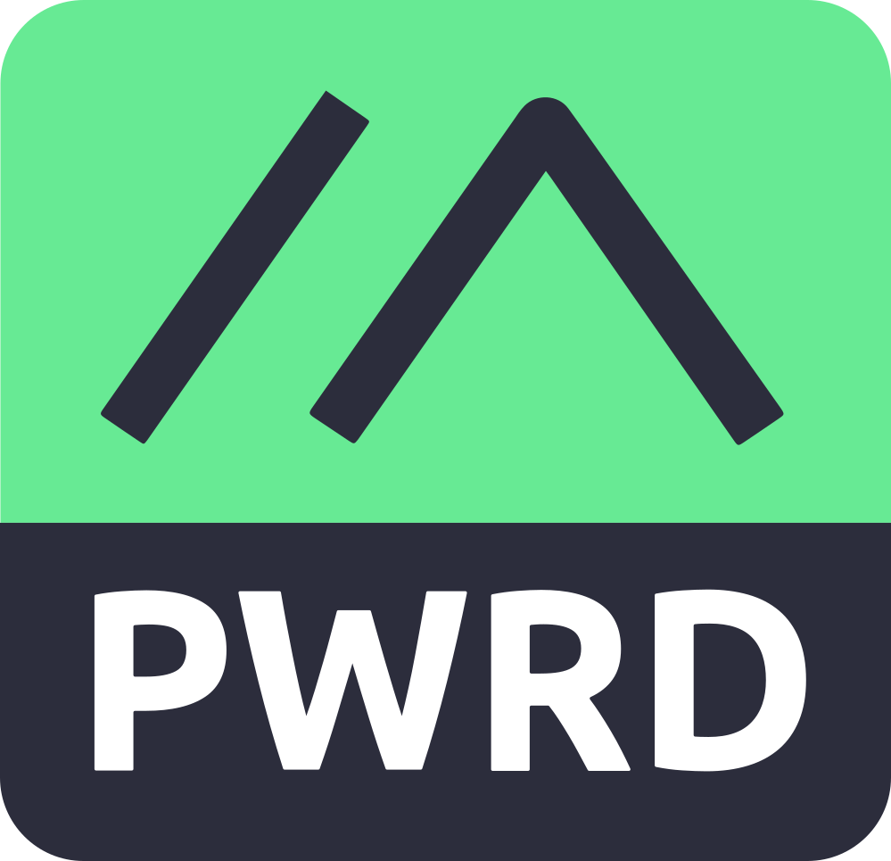
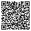

# Funkpost

[](https://meshtastic.org)

*Post über Funk* — a byte courier for local-first applications over LoRa® mesh
radios; works with Meshtastic® devices. A courier carries what it is handed,
and this one is handed three very different things: **handshakes, databases and
events.** One radio, three planes — they share the courier and nothing else, so
the difference gets a table, not a footnote:

| | **signalling plane** | **database plane** | **event plane** |
|---|---|---|---|
| what crosses the mesh | the WebRTC handshake: offer and answer, as small signed payloads | the database itself: OrbitDB entries, as signed blocks | one signed event at a time — and rules that *generate* a calendar instead of listing it |
| first contact | two frames | a few kilobytes, ~12 frames | tens of bytes; a three-week busy mask is one frame |
| WebRTC | yes — and the connection afterwards still needs an IP path (same Wi-Fi, or both online) | none — no offer, no answer, no IP path anywhere | none |
| built? | designed, **not built** | **built, and first over the air 4 Sep 2026** | **built, and first booking over the air 6 Sep 2026** |
| pick it when | there is an IP path, but no way to swap a handshake over it | who wrote what must be **provable** | the **link** is the scarce thing |
| demo | — | [mesh-todo](https://nikrause.github.io/funkpost/mesh-todo/) | [mesh-calendar](https://nikrause.github.io/funkpost/mesh-calendar/) |
| the sentence to remember | *LoRa carries the handshake, not the connection.* | *The mesh carries the data when there is no connection to carry.* | *What you do not send costs nothing.* |

Both data planes are real and neither replaces the other. Design threads:
[libp2p-webrtc-qr#161](https://github.com/NiKrause/libp2p-webrtc-qr/issues/161),
[#1](https://github.com/NiKrause/funkpost/issues/1) and
[#38](https://github.com/NiKrause/funkpost/issues/38).

A third demo, [mesh-heartbeat](docs/mesh-heartbeat.md), sits on **none** of
them: it carries no database at all and asks one question — *how far does the
mesh actually reach?* A range test that dragged a replication stack behind it
would be measuring the stack.

The announcement page for all of it, written for humans:
[lora.le-space.de](https://lora.le-space.de/).

> ### ⚠ Experimental — not for production use
>
> This is a research project. It is **not audited**, and its purpose is to
> evaluate what a LoRa mesh can carry and how two devices reconcile data over
> it — throughput, airtime, convergence. Nothing more.
>
> **Authorisation has not been designed.** That is not an oversight to be found
> later; it is a gap that is known, measured, and stated here:
>
> - In `mesh-todo` the database is opened with `write: ["*"]`. **Anyone who
>   hears an invite may write to the list.**
> - In `mesh-calendar` a booking request carries no signature. A neighbour
>   with no key and no invitation can inject them — measured on the demo's own
>   default shop: **516 of 516 slots taken, all three weeks gone, and the real
>   customer's booking superseded**, because a forged request may claim any
>   timestamp it likes ([#55](https://github.com/NiKrause/funkpost/issues/55)).
>
> The only boundary today is the **channel key**: whoever can decrypt the
> channel can write. On a public Meshtastic channel that is no boundary at all.
> A private channel is the difference between a demo and a toy, and it is still
> not authorisation.
>
> The examples are **demonstrators**, meant to be read and measured — not
> deployed, and not pointed at anybody's real calendar.

## Try it now

All four are live at
**[nikrause.github.io/funkpost](https://nikrause.github.io/funkpost/)**, which
is a menu, and every push to main redeploys them:

| | | |
|---|---|---|
| **[…/mesh-todo/](https://nikrause.github.io/funkpost/mesh-todo/)** | `mesh-todo` | a todo list over LoRa — the **database** plane |
| **[…/mesh-calendar/](https://nikrause.github.io/funkpost/mesh-calendar/)** | `mesh-calendar` | a hairdresser's appointment book — the **event** plane |
| **[…/mesh-heartbeat/](https://nikrause.github.io/funkpost/mesh-heartbeat/)** | `mesh-heartbeat` | how far does the mesh reach? — **no database at all** |
| **[…/mesh-trail/](https://nikrause.github.io/funkpost/mesh-trail/)** | `mesh-trail` | everyone on one map — **no database at all** |

Open any of them twice with `?mesh=bc` and two browser tabs play the two
devices (the booking demo wants `&role=salon` in one and `&role=customer` in
the other; the range test `&role=office` and `&role=rider`). With a Meshtastic
node over Web Bluetooth, *Connect node* makes it real.

Each one installs as a **PWA** — from the browser's install prompt on a desktop
or *Add to home screen* on a phone. Worth doing before a bench session: an
installed page has no address bar to lose and no tab to be closed by accident.

## The test channel



Two radios only hear each other if they carry the **same key**, so trying this
with someone else needs a shared one. This is ours — **scan the code with the
phone that holds your node**: the Meshtastic app's own scanner on Android, the
camera on iOS. Only the app can import a channel, which is why this is a code
and not a link.

| | |
|---|---|
| name | `le-space.de` · EU_868 · LONG_FAST |
| fingerprint | `⌗3dd3` — every demo shows this with the channel selector; **compare it across devices** |
| key | `5e08894adc2b00307796581213bbd9072bc1beaad48212d5a17873461d3e83fd` |

**This key is published, so this channel is public.** That is the point — it is
a meeting place, not a secret, and nothing here was ever protected by it
anyway. Bring your own channel (`npm run channel`, see
[channels](docs/channels.md)) for anything else.

> ⚠ **Importing replaces the whole channel set.** Every other channel on the
> device is erased, including keys that exist nowhere else. Add `?add=true`
> before the `#`, or use the app's import-as-additional option.

Before you transmit, set your own node to role **`CLIENT_MUTE`** so it stops
relaying the neighbourhood's traffic, and read
[bench etiquette](docs/bench-etiquette.md) — it is a shared medium, rationed by
law at six minutes an hour, and §4 explains when to reach for a faster preset
and why everyone testing together has to change it at once.

## Status

**4 September 2026 — the first over-the-air replication.** A todo list
replicated end to end over a **real LoRa mesh** between two independent
Meshtastic nodes, with **no IP path**: `db.put` on one side, a delta over the
paced ARQ courier, the LoRa hop, `joinEntry` on the other, both lists
converged. Two desktop browsers, each driving its own node over Web Bluetooth.

**6 September 2026 — a booking crossed the mesh.** Two nodes, EU 868,
`LONG_FAST`, no IP path: a customer's booking travelled to the shop and stood
in its day plan **31 seconds** later — an appointment the shop never entered.
The whole session cost **9.3 s of airtime**, about 2.5 % of the hourly
allowance. The courier needed no changes to carry it, which was the claim
worth testing.

**21 September 2026 — a list survived a wiped phone.** A Galaxy Fold 5 made a
list and backed it up, and was reset; a Galaxy A57 with the same YubiKey had
the same identity, brought the list back with the key alone, and wrote to it —
nothing typed in, nothing carried over.

**Not yet on real radios:** how far the mesh reaches
([#180](https://github.com/NiKrause/funkpost/issues/180)), a decision travelling
back from a salon ([#38](https://github.com/NiKrause/funkpost/issues/38)), and
a list joined cold with no internet at any point. What each bench session cost
and what is still unsettled is kept honestly in
**[field notes](docs/field-notes.md)**; what the next bench has to show — what
to press, and when each run counts — is on the **[run sheet](docs/run-sheet.md)**;
sequencing and gates are in **[ROADMAP.md](ROADMAP.md)**.

## The mesh carries the data, not the program

The obvious next question, and the answer is a measurement rather than an
opinion. `mesh-calendar`'s shell is **150 KB gzipped**, and **85 KB of that is
the Meshtastic library and the polyfills it needs** — irreducible while a
browser drives the radio over Web Bluetooth. Over LoRa that is ~780 frames:
**hours** at `LONG_FAST` once the duty cycle is counted. Set against the 9.3 s
a whole booking session costs, **shipping the app is roughly fifty times
everything it will ever do afterwards.**

So the app arrives once — over Wi-Fi, a hotspot at the counter, or a QR and one
moment of internet — and is a PWA from then on. After that it is offline, and
only the appointments use the radio. The one lever that would change the
arithmetic is not a smaller framework but a smaller *radio client*: Meshtastic
nodes also speak HTTP, and a thin client for the handful of message types this
uses would be a fraction of 85 KB.

## Where things are written down

The front page is deliberately short. One page per layer, each opening with
what is built and what is not:

| | |
|---|---|
| **[The byte courier](docs/courier.md)** | framing, selective-ACK ARQ, duty-cycle pacing — carries every plane, knows about none |
| **[Links to a node](docs/links.md)** | Web Bluetooth reality, the reconnect policy, reading what the radio says |
| **[The database plane](docs/data-plane-orbitdb.md)** | OrbitDB: signed entries and an access controller; the bootstrap, end to end |
| **[The event plane's provider](docs/yjs-provider.md)** | the Yjs half of it: tiny, loss-tolerant updates — and reusable outside this project |
| **[mesh-calendar](docs/mesh-calendar.md)** | the event plane's demo — a shop's appointment book: rules not lists, who got the slot, and how to run its tests in a browser you can watch |
| **[mesh-heartbeat](docs/mesh-heartbeat.md)** | the range test — what a round costs, what it refuses to measure, and what happens when two parties share a channel |
| **[mesh-trail](docs/mesh-trail.md)** | everyone on one map — where the group size becomes a parameter, and what that does to the interval |
| **[The signalling plane](docs/signalling.md)** | designed, not built — LoRa carries the handshake, not the connection |
| **[Channels](docs/channels.md)** | getting two devices onto one channel — `npm run channel`, and why a mismatch is silent |
| **[Bench etiquette](docs/bench-etiquette.md)** | developing on a shared, legally rationed medium without ruining it for the neighbours |
| **[Run sheet](docs/run-sheet.md)** | the runs still open on real radios — what to set up, what to press, what to write down, and when a run counts |
| **[Field notes](docs/field-notes.md)** | what broke on real hardware, and why |
| **[Neighbours](docs/related-work.md)** | the other people doing this, and the meshes within range |
| **[Why a separate repository](docs/why-separate-repository.md)** | a licence decision, and a one-way door |
| **[Notes for agents](AGENTS.md)** | the traps that cost a field evening each — read §0 and §1 before touching the connect path |

## Using it

The courier moves opaque bytes, so what sits on top is a choice. The pieces are
behind subpath exports — `@le-space/funkpost/courier`, `/yjs`, `/heartbeat`,
`/links/meshtastic-device` — so a project takes what it needs and pays for
nothing else:

```js
import { createYjsProvider } from "@le-space/funkpost/yjs";
const provider = createYjsProvider({ doc, courier });
```

**The Yjs provider is reusable outside this project.** It needs only a courier
— any object with `send(bytes)` and `onPayload(cb)` — so a WebSocket, a
`BroadcastChannel` or your own transport works as well as a LoRa mesh, and
`yjs` is an optional peer dependency behind its own subpath.

**Not on npm.** The examples take the package straight from the checkout —
`"@le-space/funkpost": "file:../.."` — and so can you.

## The topology

```
   Phone A ──BLE── Node A ))))  LoRa  (((( Node B ──BLE── Phone B
      │                                                      │
      └── funkpost courier: framing · ARQ · duty-cycle pacing ┘
                │                   │                  │
         database plane        event plane     just a heartbeat
```

No IP path anywhere in that picture. That is the whole point, and everything
else is detail — which now lives on its own page.

## Neighbours

The same courier pattern applied to money, the mesh stacks that are not
Meshtastic, and the communities within radio range of this project's test
channel: **[neighbours](docs/related-work.md)**. None of them is affiliated
with funkpost, and two of them are living proof that what fits through this
pipe is exactly the small signed payload.

## Trademarks

Meshtastic® is a registered trademark of Meshtastic LLC. Meshtastic software
components are released under various licenses, see GitHub for details. No
warranty is provided — use at your own risk. LoRa® is a trademark of Semtech
Corporation.

This project is not affiliated with or endorsed by Meshtastic LLC or Semtech;
it *works with* Meshtastic devices and is named to say so. The M-PWRD badge
above is the logo Meshtastic's
[trademark policy](https://meshtastic.org/docs/legal/trademark/) provides for
projects using the technology, no grant required; the asset is the official one
from [meshtastic/design](https://github.com/meshtastic/design/tree/master/Meshtastic%20Powered%20Logo).
Commercial use of the Meshtastic firmware and marks carries their own terms in
addition to the GPLv3.

The Le Space name and mark belong to Le Space UG (haftungsbeschränkt). The pages
here carry them by the brand's own rules — the control pill and the credit line
in [`examples/brand`](examples/brand) — and the GPL covers the code that draws
them, not the right to use them elsewhere.

## Supporting this

[](https://github.com/sponsors/NiKrause)

The work here is radios on a desk, hours of airtime, and the bench sessions
written up in the [field notes](docs/field-notes.md). Nothing about it is
funded, and nothing about it is for sale — it is GPL-3.0 and stays that way.

If it is useful to you, the **Sponsor** button at the top of this repository is
the least friction. Prefer to keep it off a platform — all three work, and each
was checked against its own checksum before it went up here (bech32, Keccak-256,
mod-97). A mistyped crypto address is refused by the wallet; a mistyped IBAN can
be somebody else's account.

| | |
|---|---|
| **₿ Bitcoin** | `bc1qz7xswl5fsq8qswgphu5vv75qwf99wx6ca6zw57` |
| **ɱ Monero** | `47L7qyE2GLvDSd4RkVjxy8du78J12Lj4JLvrWBRDakkZGSCpLDmTbY5DRs4BjGdbrySQ35e5wpZfBUwdU5ZcMSUw49E1y7j` |
| **Bank transfer** | Le Space UG (Nico Krause) · GLS Bank Bochum<br>`DE73 4306 0967 8219 2914 00` |

## Licence

GPL-3.0-only. See [LICENSE](LICENSE).
