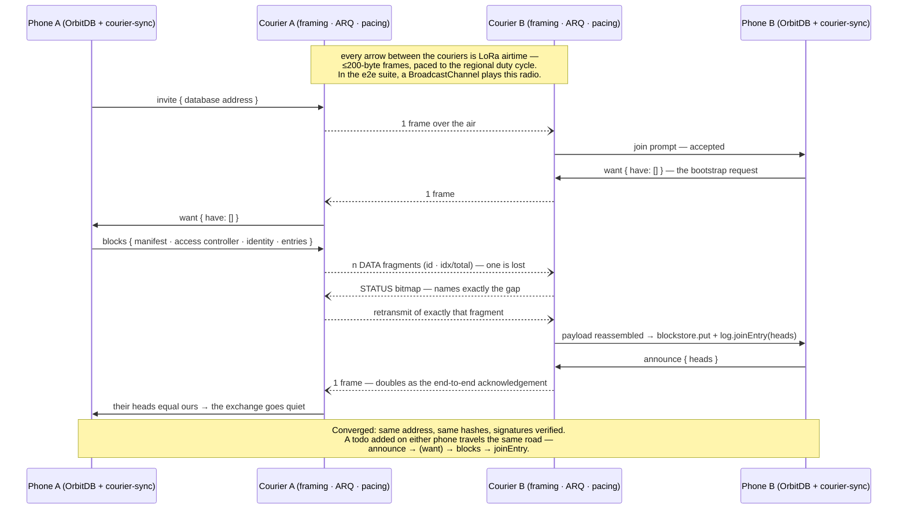
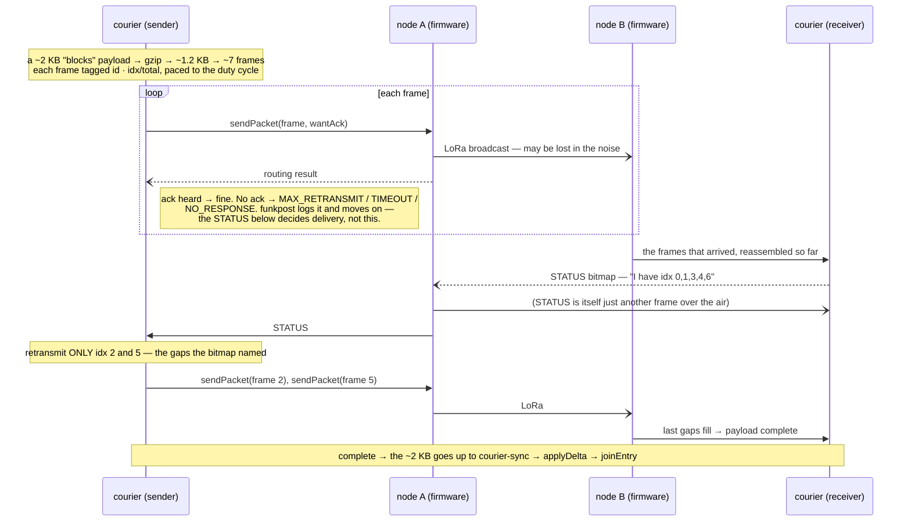

<!-- SPDX-License-Identifier: GPL-3.0-only -->

# The OrbitDB data plane

Status: **built and tested on hardware — first over-the-air replication 4 September 2026**

## The data plane — built

Two peers whose *only* link is the mesh cannot have a WebRTC channel — but
they can have a replicated OrbitDB database: entry by entry over the radio,
big things via [Storacha](https://github.com/NiKrause/orbitdb-storacha-bridge)
once one side finds the internet again. Design, arithmetic and the S1–S5
build plan live in
[issue #1](https://github.com/NiKrause/funkpost/issues/1)
(the plan itself:
[the build-plan comment](https://github.com/NiKrause/funkpost/issues/1#issuecomment-5532165277);
the per-jurisdiction airtime law:
[the duty-cycle comment](https://github.com/NiKrause/funkpost/issues/1#issuecomment-5531989292)).

The transport-neutral half — `courier-sync`, the diff/bundle/apply protocol —
deliberately does **not** live here: it is MIT, designed against an abstract
courier in
[orbitdb-storacha-bridge#50](https://github.com/NiKrause/orbitdb-storacha-bridge/issues/50),
and this repository binds it to the radio. The licence section below says why
that direction is the only one that works.

### One bootstrap, end to end

No WebRTC anywhere in this picture — that is the point of the plane:



### Deeper: four layers, and two acknowledgements

The diagram above is the *what*. Underneath it are four layers, each with one
job — and the confusing part (why `MAX_RETRANSMIT` is not a failure) lives at
the boundary between the bottom two.

| layer | job | vocabulary |
|---|---|---|
| **OrbitDB** | hold the data as a signed, content-addressed log | `db.put`, oplog entry, heads, `joinEntry` |
| **courier-sync** | decide *what* to send | `announce` / `want` / `blocks`, `createDelta` / `applyDelta` |
| **courier** | get a payload across a tiny-MTU, lossy carrier | fragments, **STATUS** bitmap, selective-ACK ARQ, pacing |
| **Meshtastic / LoRa** | move one packet over the air | `sendPacket`, `wantAck`, routing result |

**Creating a list** is just `db.put` at the top layer: it writes a signed entry
to the local oplog and updates the *heads* (the newest entries). The database
**address** is the hash of its manifest — the same name, type and access
controller produce the **same address on every device**, which is why an invite
is only that address: whoever opens it lands on the identical database.

**Receiving** never touches `db.put`. courier-sync puts the raw signed blocks
into the blockstore and calls `joinEntry(head)`, which walks the parents *from
local storage*, re-verifies every signature and the access controller, and
splices them in. Authoring uses `put`; replicating uses `blockstore + joinEntry`
— the same split OrbitDB's own pubsub sync uses, and the same the
[Storacha bridge](https://github.com/NiKrause/orbitdb-storacha-bridge) uses to
restore.

Now the crux. **There are two separate acknowledgements, and only one of them
is the truth:**

- **The radio's per-packet ack** (Meshtastic, `wantAck`). When the courier
  hands a frame to the node, it asks the mesh to confirm that one packet. On a
  busy public channel — 140 neighbours all contending — that confirmation
  often never comes back, and the firmware reports **`MAX_RETRANSMIT`** (it
  retried and gave up), **`TIMEOUT`**, or **`NO_RESPONSE`**. Crucially, on a
  broadcast this means *"no ack was heard"* — **not** *"the packet did not
  arrive."* The packet may well have crossed; nobody sent back a receipt. So
  funkpost treats these three as soft: the frame counts as sent, and the
  courier does **not** abort the payload over them.
- **funkpost's end-to-end STATUS bitmap** (the courier's own ARQ). The
  *receiver* answers with a bitmap of exactly which fragments it holds, and the
  sender retransmits **only the missing ones**. This is the real delivery
  authority — it is end to end, it is exact, and it does not depend on the
  radio's unreliable per-hop ack.

One payload's journey, with both acknowledgements shown:



So on a **quiet or private channel** the radio ack usually comes, sends resolve
fast, and a bootstrap crosses in one or two rounds. On a **busy public channel**
the radio ack keeps failing (`MAX_RETRANSMIT`) and airtime burns on the
firmware's own retries — the sync still completes, driven by the STATUS ARQ,
but slowly and wastefully. **A private channel with just the two nodes is both
the reliable setup and the privacy-correct one**; the public channel is for
first contact and demos.

### The example: mesh-todo

[`examples/mesh-todo`](../examples/mesh-todo) runs that sequence live and is the
bench instrument in one: a todo list on OrbitDB, replicating over the courier,
with a sync pane that prices every protocol message in packets and airtime —
the hardware gates are read off exactly that pane. It is deployed at
**[nikrause.github.io/funkpost/mesh-todo/](https://nikrause.github.io/funkpost/mesh-todo/)**; for
local development:

```sh
npm run dev -w @le-space/mesh-todo-example
```

Open it twice with `?mesh=bc` and the two tabs play the two phones over a
BroadcastChannel fake mesh (`&loss=0.15` makes the radio lossy). Without the
parameter, *Connect node* opens the Web Bluetooth chooser for a real
Meshtastic node — Chrome/Edge, user gesture required, and on a phone the page
must be served over HTTPS (during development: `adb reverse tcp:5199 tcp:5199`
makes the dev server a secure `localhost` on the phone). Write access in the
demo list is open on purpose: the mesh channel's PSK is the demo's trust
boundary, and per-identity ACLs are a design conversation in issue #1.

### Tests, and the gate that remains

```sh
npm test
```

runs the unit and integration suites, including the composed proof
([`test/full-stack.test.js`](../test/full-stack.test.js)): two OrbitDB peers
converge through courier-sync → ARQ → pacing → a mesh that drops frames, while
both libp2p nodes hold **zero connections**. The e2e suite
([`examples/mesh-todo/e2e`](../examples/mesh-todo/e2e)) then runs the whole
hand-test script in CI — clean mesh, a mesh that eats a fifth of all frames,
the empty-room regression, and a wiped peer re-bootstrapping its history.

Only physics is missing, and physics is plan step S5:

```sh
NODE_A=<ip> NODE_B=<ip> npm run bench:goodput
```

drives the real courier between two TCP-reachable nodes and prints the gate
numbers — single-entry latency (target: seconds to low tens) and the
ten-entry bootstrap, where **over ~10 minutes on a quiet channel, live sync
loses to the pointer-CID mode** (issue #1's phase-2 gate).

---

← [funkpost](../README.md) · [ROADMAP](../ROADMAP.md)
